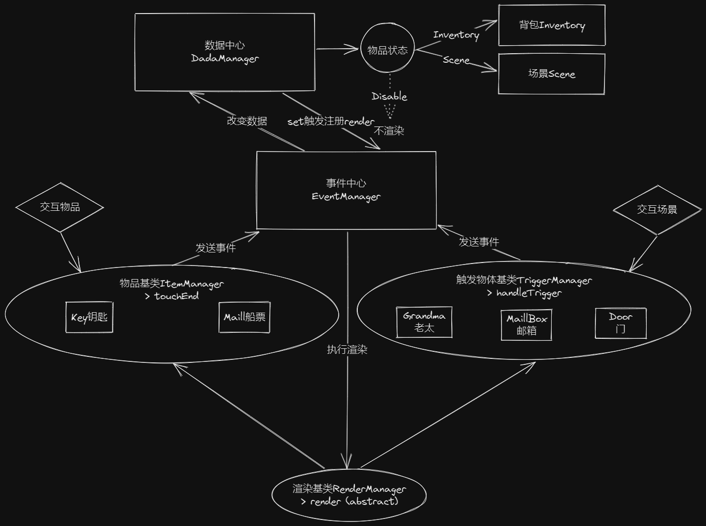

# cocos_cotton

项目效果：https://arutowk.github.io/cocos_cotton/

题目如下：

> 请实现该游戏，是一个简单的解谜游戏，实现时间为一个礼拜。
> 该游戏共有 5 个场景，H1-H4，其中 H2A 是一个小游戏。每个目录均有该场景的介绍，请细看。
> 玩家一进去是在 H1 场景，通过鼠标/触摸屏点击进行操作。都是点触操作。
> 其中音乐目录下有两个背景音乐，在 H2A 场景中播放 OpenRoad.mp3，其他场景播放 PaperWings.mp3。
> 请自行制作一个主界面，有两个按钮，新游戏和继续游戏。
> 道具使用逻辑：
> 点击道具栏的道具进行选中（显示手的素材，相当于拿了道具），然后点击场景进行使用判断。
> UI 部分有：
> 1、右上角 menu 按钮，点击后返回主界面。
> 2、右下角有道具栏，游戏中拾取到的道具会出现在道具栏中，点击左右可以进行切换
> 要求：
> 1、需要有存档功能
> 2、UI 采用 UGUI 进行制作。
> 3、请设计一个简单的框架，以满足更多场景更多逻辑的流程控制

---

# 项目总结

## 分析图

## 重难点

-   背包的实现
-   数据和 UI 分离来实现存档和重新游戏
-   小游戏的动态渲染和操作逻辑
